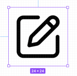
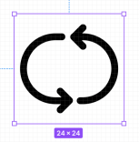
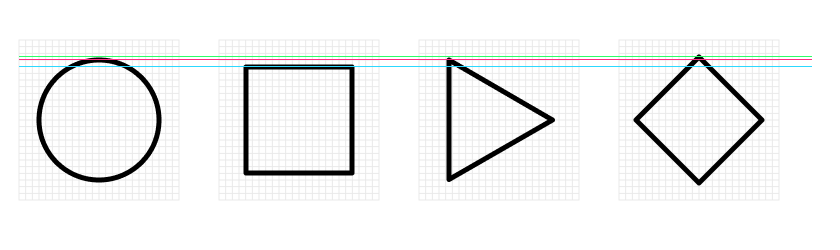

# Moonicon

### Design principles

Concise

Keep the graphics simple and highly recognizable, remove unnecessary decorations and lines, and the color is monochrome by default.

General

Use the common shapes and graphics in the current UI to reduce the difficult of understanding.

Unification
Ensure the uniformity of icon size, line thickness, endpoint future, corner feature and filleted corner future.

### Basic Information

Size

The size range of the outer border of the icon is set to 24 x 24px. This range servers as the virtual boundary of all icons(usually with blank parts), and it is the reference boundary for alignment and scaling.

    
    

Drawing Method

For most icons, the linear contour method is used to draw the head and corner shape of ** line and select the arc. The default contour thickness is 1.5px. the default color is pure black #000000.

For different scene icons with different sizes, the width of the contour can be adjusted according to the actual visual effect and context. It is recommended to se it at a hierarchical level, for example, the icon contour is corresponding to 16px,24px and 32px are set to 1, 1.5 and 2 px respectively.

### Icon Drawing Detail

Basic graphics and Visual Size

The basic shapes of icons can be divided into square, rectangle, rhombus, circle, triangle, and abnormity. In order to keep their visual size equal, their absolute size should be adjusted. For example, the outer boundary of the circle should be larger than the square, so that they look roughly equal.

    
    
Visual resizing of basic shapes

Filleted Corner Size

In many icons that draw boxes and right angles, in order to increase the affinity of graphics(not too sharp), it is recommended to use 2px filleted corner. Such filleted corners usually appear in larger borders and corners. For the smaller details in the icon and the corners at different angles, the size of the filleted corner can be handled as appropriate.

    
    
For example, the bottom part of DELETE icon is set to 2px filleted corners 
    

### Others

Complex logo icon

For icons commonly used with logo as recognition feature such as Twitter、Chrome、Discord、Github, etc., the drawing method of linear icon is not applicable. It is a more general form of expression to use the existing and commonly used graphics. Here we will continue to use it instead of creating linear icons.

> Note:
> Follow up the updates of these brand logos, such as Taobao’s new “Tao” logo.
> Use standard English expressions and pay attention to the case of icon naming.
